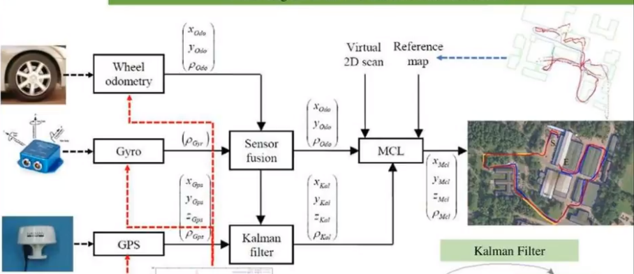
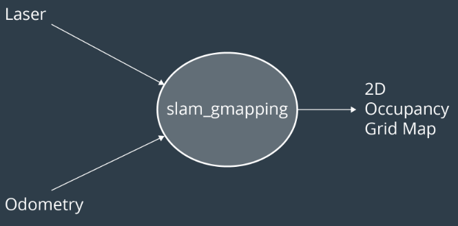
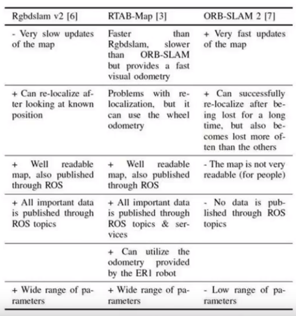

-> # RTAB-SLAM Implementation in ROS <- 

-> Qiwei Yang March, 27, 2019 <- 

### Abstract

Robot localization and mapping are essential in robotics. Different problems are formed according to availability of the information. However, if
neither of them is known, this problem becomes Simultaneous Localization and Mapping (SLAM for short). There are several 

### Introduction

Robot localization is essential to solve robot path planning / navigation tasks. Localization problem is that, a map and the robot's 
initial poses are already known to the robot. It needs to accurately estimate its poses simultaneously through measurements while moving in it. Two different algorithms work very well
to solve localization problems, one is the (extended) kalman filter, and the other monte carlo localization. In practice, these two algorithms
are combined to generate very accurate result. Robotics motion, IMU measurements, GPS, etc, are first feed into a kalman filter, and then monte
carlo method is applied for further process.

  

On the other hand, if the map is unknown to the robot, while the initial poses are still known. The robot needs to construct the map about its environmetn 
while it is navigating in the environment, this is called mapping. After the map is constructed, path planning and navigation can be performed sequentially.

Further more, if both the map and initial poses are unknown to the robot, the robot needs to construct the map and at the same time, estimate its
poses, this problem is called SLAM. How can the robot achieve this? The inputs for the problem
are measurements and control, and outputs are poses (trajectory is comprised of series of poses). 

  

Planning under uncertainties, which are resulted from inaccurate controller, imperfect sensors, 
unexpected environments, etc, is a quite challenging. Accurate estimation of the robot states or poses, which localization aims to accomplish, is critical in decision making under these
uncertainty.
      
There are several powerful algorithms to estimate the robot location, two of which are covered in this project, Kalman Filter and Monte Carlo Localization. ROS community provides packages like AMCL and Navigation
to allow users to easily implement these algorithms in Gazebo simulator.  

## 1. Introduction

There are two key capabilities that a robot shall have when it moves in an environment: Localization and Mapping. Localization means the robot knows the environment or map in advance,
and need to accurately identify where it is continuously when moving, so that it knows if it is approaching the target location in the right direction. Mapping means the robot has no idea about
the environment in advance, but it knows its location and can continuously update the info with confidence, therefore it can map the environment simultaneously when moving. 
Simultaneous localization and mapping, SLAM for short, is a hot research area both in academia and industry. This project deals with localization problem only.    

Localization can be divided into three sub-problems : local localization, global localization, and the kidnapping. In the local localization, also
known as position tracking, the robot knows its initial pose and the problem is to keep track of the robot’s pose as
it moves. In global localization, the robot’s initial pose is unknown, and the robot tries to determine its pose relative
to the ground truth map; the uncertainty for this type of localization is greater than for local localization. In the
kidnapped robot problem, just like in global localization, the robot’s initial pose is unknown, however the robot maybe
kidnapped at any time and moved to another location of the map. Solving for the latter challenge also helps the robot
recover in the event that it loses track of its pose, due to either being moved to other positions, or even when the
robot miscalculates its pose. [reference](https://github.com/csosa27/RoboND-Localization-Project/blob/master/Where%20Am%20I.pdf)

## 2 Mainstream Filters: 

Given only the mean and standard deviation of noise, the Kalman filter is the best linear estimator [refer](http://biorobotics.ri.cmu.edu/papers/sbp_papers/integrated3/kleeman_kalman_basics.pdf). 
Extended kalman filter can be applied for non-linear systems. On the other hand, Monte Carlo method, also called particle filter, can be applied for non-linear systems easily. 
Particle filter is computationally more expensive than Kalman filter, but easier to implement and understand. 

### 2.1 Kalman Filter and Extended Kalman Filter  

#### 2.1.1 Kalman Filter(KF)  
KF in a nutshell:   

A KF is an optimal estimation algorithm mainly invented by Rudolf E. Kalman. Common applications include guidance and navigation systems, computer vision systems and signal processing. It has two major applications:  

1. The variables of interest can only be measurement indirectly.  
2. Several measurements are available from various resources but are subject to noise. 

It is **recursive** so that new measurements can be processed as they arrive.  
  
Specifically in this project, there are two main uncertainties existing in the localization. One is the control or motion uncertainty, the other measurement noisy. In practice, these uncertainties follow the gaussian distribution pretty well.
KF makes use of this property and consider both of them to estimate the location. See the figure below: 

  

[MATLAB reference](https://www.mathworks.com/videos/understanding-kalman-filters-part-5-nonlinear-state-estimators-1495052905460.html)  

"Predicted state estimate" mentioned in the figure is generated from robot motion through controller/actuator, which has uncertainty for sure. For example, the robot may
have unwanted wheel slip, motor inaccuracy, etc. In addition, all measurements have noises, and not perfect. Usually considering their errors generate better estimation than considering only one of them along. 

#### 2.1.2 Extended Kalman Filter(EKF)  

Many practical systems have non-linear state update or measurement equations.
### 2.2 Monte Carlo Localization method (also called Particle filters)  

  

[Matlab MCL introduction](https://www.mathworks.com/help/robotics/ug/monte-carlo-localization-algorithm.html)  
Particle filters
Monte Carlo localization algorithm similar to Kalman Filters estimates the posterior distribution of a robot’s position and orientation based on sensory information but instead of using Gaussians it uses particles to model state.

The algorithm is similar to KF where motion and sensor updates are calculated in a loop but MCL adds one additional step: a particle resampling process where particles with large importance weights (computed during sensor updates) survive while particles with low weights are ignored.

In the MCL example below all particles are uniformly distributed initially. In the following update steps the particles that better match the predicted state survive resulting in a concentration of particles around the robot estimated location.

### SLAM Comparison

[Reference] (https://arxiv.org/abs/1707.09808) 

 

[kalman filter, matlab](https://blogs.mathworks.com/headlines/2016/09/08/this-56-year-old-algorithm-is-key-to-space-travel-gps-vr-and-more/)  

[Robot mapping] (https://arxiv.org/abs/1707.09808)  

[biorobotics kalman filter](http://biorobotics.ri.cmu.edu/papers/sbp_papers/integrated3/kleeman_kalman_basics.pdf)  

[CMU kalman filter] (http://www.cs.cmu.edu/~16831-f14/notes/F10/16831_lecture20_21_zlamb_jlibby/16831_lecture20_21_zlamb_jlibby.pdf)  
