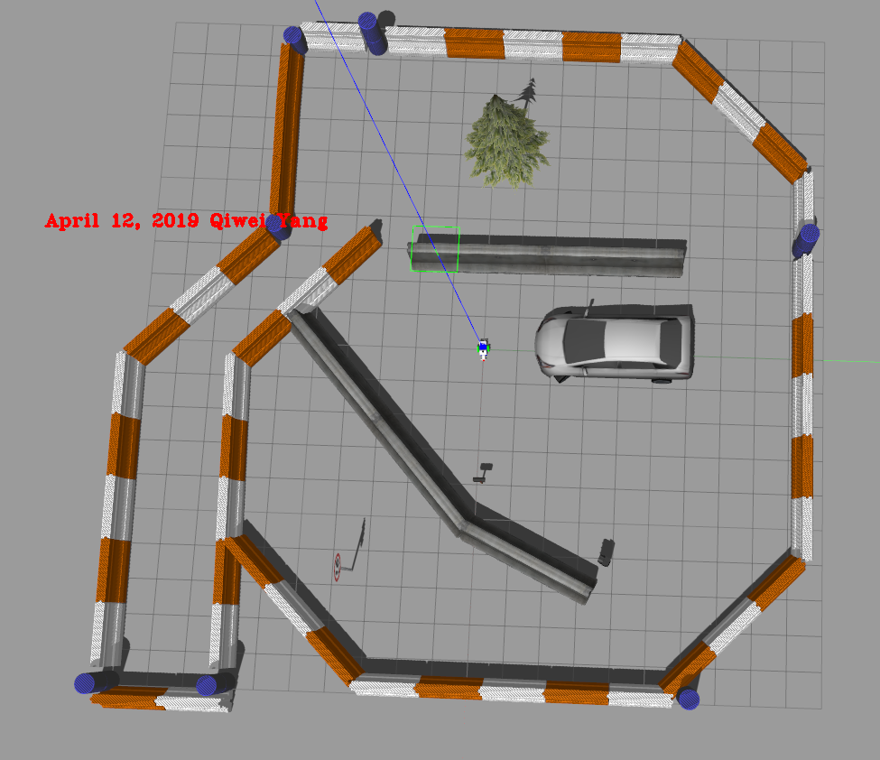
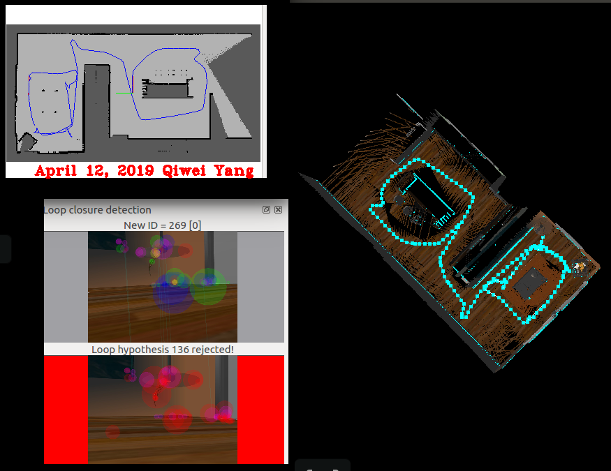

-> # RTAB-SLAM Implementation <- 

-> By Qiwei Yang May 02, 2019 <- 

### Abstract

Robot localization and mapping are essential in robotics. Different problems are formed according to availability of the information. However, if
neither of them is known, this problem becomes Simultaneous Localization and Mapping (SLAM for short). There are several slam algorithms: 
RGBD-slam, RTAB-SLAM, ORB-SLAM. In this project, RTAB-SLAM, Real Time Appearance Based Mapping, is used to construct the environment map.
  
### Introduction

Robot localization is essential to solve robot path planning / navigation tasks. Localization problem is that, a map and the robot's 
initial poses are already known to the robot. It needs to accurately estimate its poses simultaneously through measurements while moving in it. Two different algorithms work very well
to solve localization problems, one is the (extended) kalman filter, and the other monte carlo localization. In practice, these two algorithms
are combined to generate very accurate result. Robotics motion, IMU measurements, GPS, etc, are first feed into a kalman filter, and then monte
carlo method is applied for further process.

  
[Reference] (https://ieeexplore.ieee.org/document/4650585) 

On the other hand, if the map is unknown to the robot, while the initial poses are still known. The robot needs to construct the map about its environmetn 
while it is navigating in the environment, this is called mapping. After the map is constructed, path planning and navigation can be performed sequentially.

Further more, if both the map and initial poses are unknown to the robot, the robot needs to construct the map and at the same time, estimate its
poses, this problem is called SLAM. How can the robot achieve this? The inputs for the problem
are measurements and control, and outputs are poses (trajectory is comprised of series of poses). 

  
[Reference] (Udacity Robotics Course) 

## 2. Project Goal

The main purpose of this project is to get me familiar with RTAB-SLAM package, and how to set up the environment to make it work properly.
The difficulty of this project is mainly due to the complex configuration of different files, such as .world, urdf file, rtabmap_ros parameters, etc.
 

## 3. SLAM Challenges

Big challenges in SLAM are mainly due to high dimensions. The continuous parameter space composed of the robot poses and the location 
of the objects is highly dimensional. While mapping the environment and localizing itself, the robot will encounter many objects and 
have to keep track of each one of them. Thus, the number of variables will increase with time, and this makes the problem highly 
dimensional and challenging to compute the posterior.

In addition, the discrete parameter space is composed out of the correspondence values, and is also highly dimensional due to the large number 
of correspondence variables. Not only that, the correspondence values increase exponentially over time since the robot will keep sensing 
the environment and relating the newly detected objects to the previously detected ones. Even if you assume known correspondence values, 
the posterior over maps is still highly dimensional.

## 4. RTAB-Mapping

RTAB-Map (Real-Time Appearance-Based Mapping) is a RGB-D, Stereo and Lidar Graph-Based SLAM approach based on an incremental 
appearance-based loop closure detector. The loop closure detector uses a bag-of-words approach to determinate how likely a new 
image comes from a previous location or a new location. When a loop closure hypothesis is accepted, a new constraint is added to 
the map’s graph, then a graph optimizer minimizes the errors in the map. A memory management approach is used to limit the number 
of locations used for loop closure detection and graph optimization, so that real-time constraints on large-scale environments 
are always respected. RTAB-Map can be used alone with a handheld Kinect, a stereo camera or a 3D lidar for 6DoF mapping, or on a 
robot equipped with a laser rangefinder for 3DoF mapping.
[rtabmap](hhttp://introlab.github.io/rtabmap/)  

## 5. Scene and Robot

### 5.1 Scene

A new scene was built by modifying the Jackal_race environment.

 

### 5.2 Robot

A simple robot was built and its information was shown below: 

 

 

### 5.3 Result

 

However, if an environment that has no obvious landmarks, or all images are similar to each other. RTAB-Slam does not work well. 
As you can see below, the quality of the world map constructed is poor1.
 
 

## 6. SLAM Comparison

[Reference] (https://arxiv.org/abs/1707.09808) 

 
